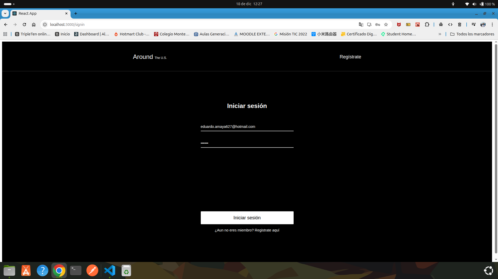
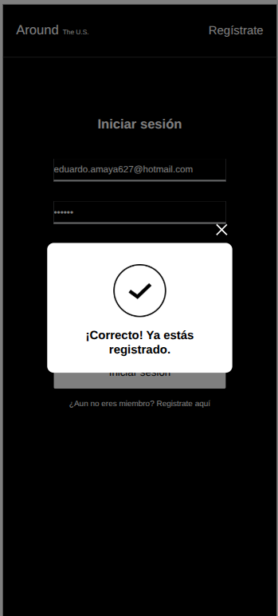
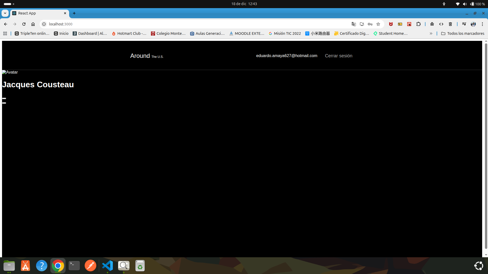
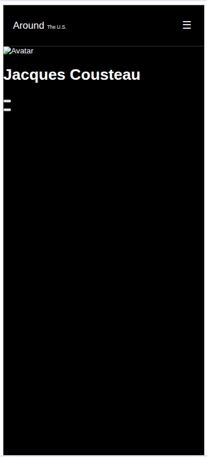

# 🌍 Alrededor de los EE.UU. — Autenticación y Autorización

Este proyecto es una extensión del proyecto **“Alrededor de los EE.UU.”**, en el cual se implementa el **registro y la autorización de usuarios** utilizando React.  
El objetivo principal es proteger el contenido de la aplicación mediante autenticación basada en **JWT**, asegurando que solo los usuarios autorizados puedan acceder a la ruta principal.

---

## 🚀 Funcionalidad del proyecto

La aplicación permite:

- 🔐 Registro de nuevos usuarios (`/signup`)
- 🔑 Inicio de sesión de usuarios existentes (`/signin`)
- 🛡️ Protección de la ruta principal (`/`) mediante autenticación
- 💾 Almacenamiento del token JWT en `localStorage`
- 🔄 Verificación automática del token al cargar la aplicación
- 🚪 Cierre de sesión con eliminación del token
- 📱 Diseño responsivo según Figma (desktop y mobile)
- ℹ️ Ventanas emergentes informativas (InfoTooltip) para registro exitoso o errores

Si un usuario no autorizado intenta acceder a la ruta principal, es redirigido automáticamente a la página de inicio de sesión.

---

## 🛠️ Tecnologías y técnicas utilizadas

- **React** (CRA)
- **React Router DOM**
  - `<Switch />`, `<Route />`, `<Redirect />`
  - `useHistory`
- **JavaScript (ES6+)**
- **HTML5**
- **CSS3**
  - Metodología BEM
  - Diseño responsivo con Media Queries
- **API REST**
  - Backend de TripleTen para registro y autorización
- **JWT (JSON Web Token)**
- **LocalStorage**
- **Context API**
  - `CurrentUserContext`

---

## 📸 Capturas de pantalla

### Inicio de sesión (Desktop)


### Registro de usuario (Mobile)


### Usuario Logueado (Desktop)


### Usuario Logueado (Mobile)


```md
🌐 Demo en GitHub Pages
🔗 GitHub Pages:
El proyecto no está desplegado públicamente ya que el repositorio es privado.

📁 Estructura del proyecto

src/
 ├─ blocks/
 ├─ components/
 ├─ contexts/
 ├─ images/
 ├─ utils/
 ├─ index.js
 ├─ index.css

✅ Estado del proyecto
✔️ Proyecto funcional
✔️ Cumple con los requisitos del sprint
✔️ Listo para revisión y entrega

👨‍💻 Autor
Eduardo Amaya
Frontend Developer Junior

---